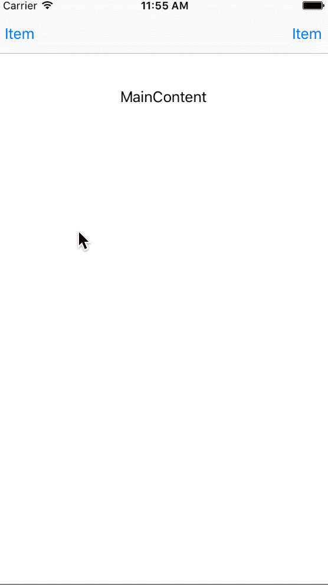
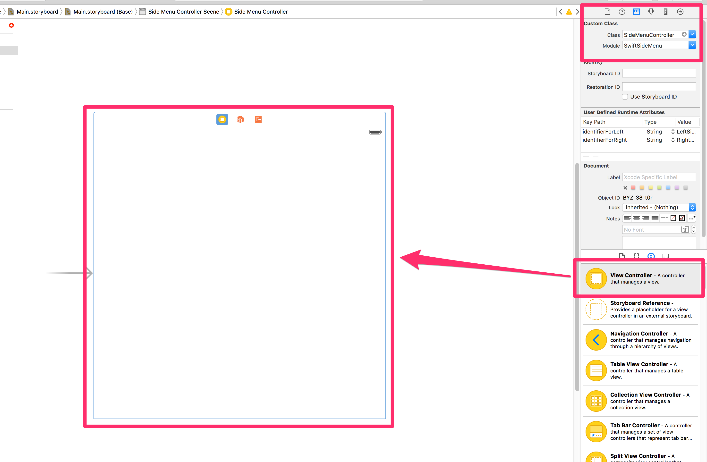
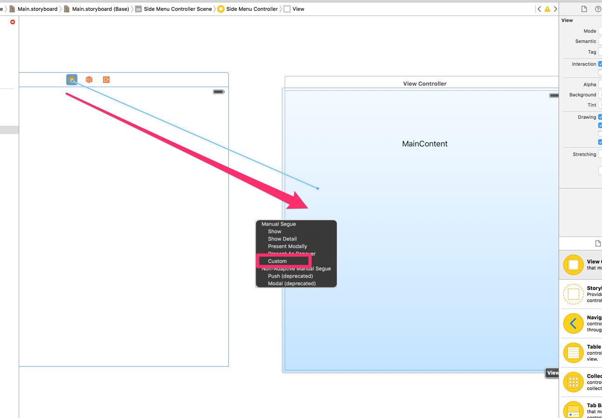
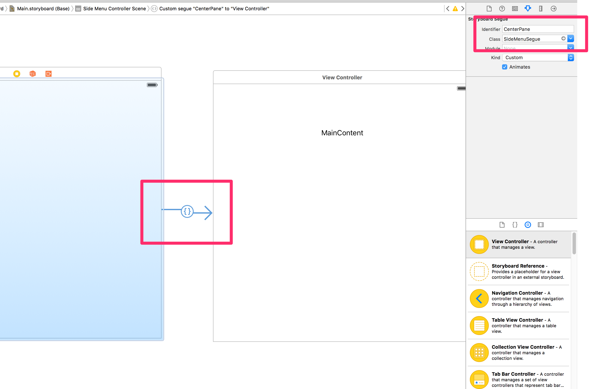
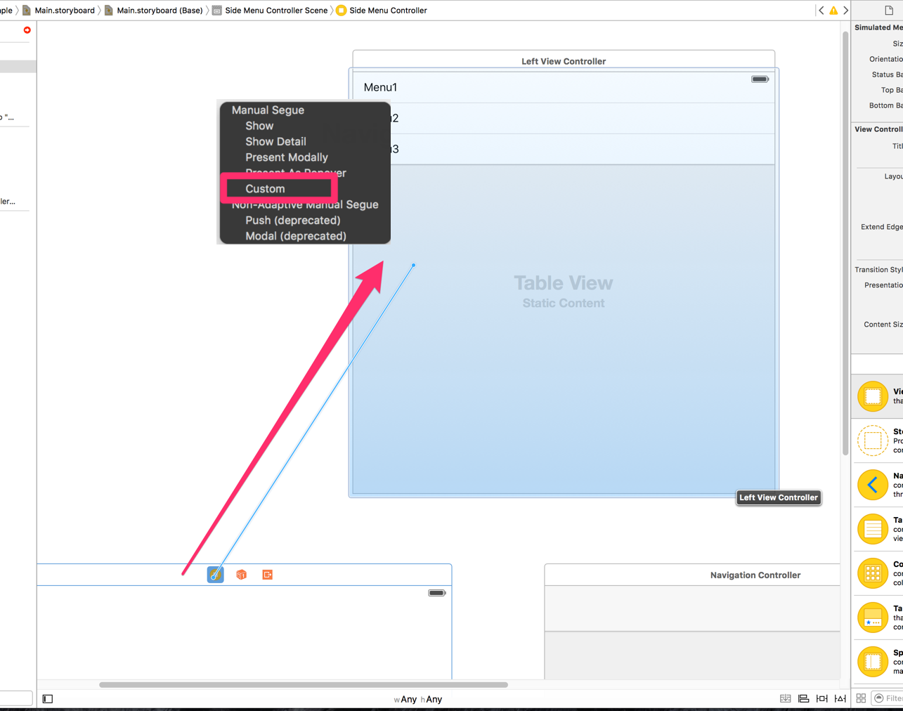
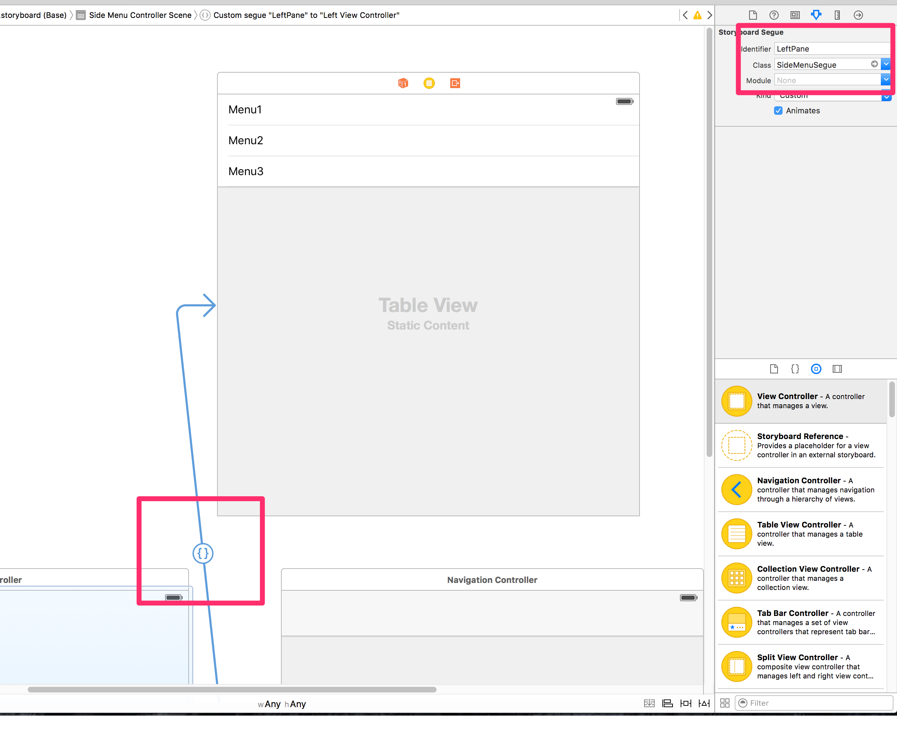
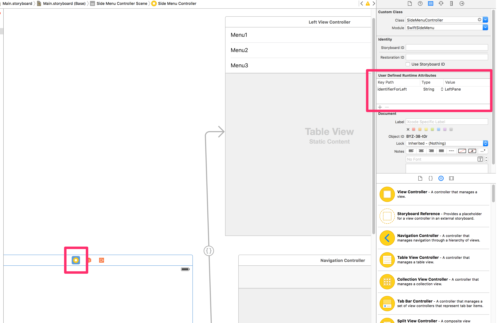

SwiftSideMenu
========
[](https://github.com/Carthage/Carthage)

SwiftSideMenu is a UI library for iOS in swift.
- configurable on Interface Builder



## Requirements
- Swift 2.1
- iOS 8.0 or later

## Installation

### Carthage

If you are using [Carthage](https://github.com/Carthage/Carthage). you just add a line for SwiftSideMenu in to your Cartfile:

```
github "guccyon/SwiftSideMenu"
```


## Usage

1. add SideMenuController on your storyboard


2. prepare MaivView

    2-1. Add MaivView on storyboard, then connect custom segue from SideMenuController to it.
    
    You can embed the MainView in NavigationController.

    2-2. Select the connected segue, then set value ```Class = SideMenuSegue ```, ```Identifier = CenterPane``` from property editor.
    

3. prepare SideMenu
    3-1. Add SideView on storyboard, then connect custome segue from SideMenuController to it.
    

    3-2. Select the connected segue, then set value ```Class = SideMenuSegue ```, ```Identifier = LeftSidePane``` from property editor.
    you can set Identifier value as you like. this value will be used on next step.
    

    3-3. configure User Defined Runtime Attribute to SideMenuController
    ```
    Key = identifierForLeft
    Type = String
    Value = $(value set on 3-2)
    ```
    (※For right side, it must be ```Key = identifierForRight```)
    
    If you set values for both of left and right, it will show menu on both side.


## APIs

#### UIViewController.sideMenuController() -> SideMenuViewController?
It get SideMenuController instance when it is called from UIViewContoller managed by SideMenuController.
otherwise it will return nil.

#### SideMenuControllerDelegate
This is delegate called when side menu visibility is changed.

In order to enable this delegate, you must set delegate like this.
```swift
// in MainView

override func viewDidLoad() {
  super.viewDidLoad()
  sideMenuController()?.delegate = self
}
```

|Method|Description|
|------|-----|
| willShowSideMenu(sideMenuController:SideMenuController) | called before showing SideMenu |
| willHideSidePane(sideMenuController:SideMenuController) | called before hiding SideMenu |
| didShowSideMenu(sideMenuController:SideMenuController) | called after showing SideMenu |
| didHideSidePane(sideMenuController:SideMenuController) | called after hiding SideMenu |

#### SideMenu.DisplayOrder
|Type|Description|
|------|-----|
| .Front | overlap order of SideMenu (Front) |
| .Back  | overlap order of SideMenu (Back) |

#### SideMenu.Position
|Type|Description|
|------|-----|
| .Left  | display position of SideMenu (Left) |
| .Right | display position of SideMenu (Right) |

#### SideMenuControlller
|Method|Description|
|------|-----|
| toggleSideMenu(position: SideMenu.Position = .Left) | toggle SideMenu visibility |


#### UIViewController life cycle methods
when SideMenu visibility is changed, followin 4 methods will be called on UIViewController which is set on SideMenuController as left or right menu. implement it with override keyword as usual.
* viewWillAppear(animated: Bool)
* viewDidAppear(animated: Bool)
* viewWillDisappear(animated: Bool)
* viewDidDisappear(animated: Bool)

#### Customization
##### SideMenuController
You can customize behavior, when you set these values to SideMenuController before display.

```swift
import SwiftSideMenu

class AppDelegate: UIResponder, UIApplicationDelegate {
  func application(application: UIApplication, didFinishLaunchingWithOptions launchOptions: [NSObject: AnyObject]?) -> Bool {
    SideMenuController.displayOrder = SideMenu.DisplayOrder.Front
    SideMenuController.revealPercentage = 0.5
  }  
}
```
|Property|Description| Default |
|------|-----|-----|
| static displayOrder:SideMenu.DisplayOrder | overlap order | .Back |
| static revealPercentage:CGFloat | size rate of SideMenu (0.0 - 1.0) | 0.7 |
| static revealAnimationDuration:NSTimeInterval | animation duration to show SideMenu | 0.3 |
| static hideAnimationDuration:NSTimeInterval |　animation duration to hide SideMenu | 0.2 |

## Reference
This library was implemented by following repositoty to reference
[teodorpatras/SideMenuController](https://github.com/teodorpatras/SideMenuController)

## License

SwiftSideMenu is licensed under the MIT license. See [LICENSE](LICENSE) for more info.
